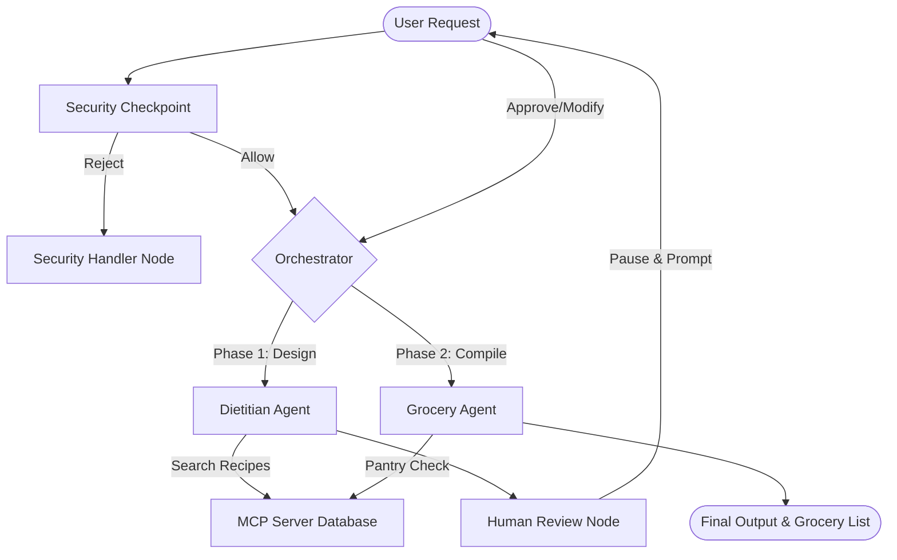

# 📝 Submission Write-Up: Nutri-Chef Agent

This submission document details the problem statement, architecture, security controls, Model Model Protocol (MCP) integrations, human-in-the-loop flows, and testing suite for **Nutri-Chef**.

---

## 🎯 Problem Statement

Adopting and maintaining a healthy diet requires meticulous planning: sourcing compatible recipes, calculating nutritional needs, checking existing home pantry inventory to reduce food waste, and compiling organized grocery lists. In addition, users need an interactive interface where they can customize their plans before purchasing ingredients.

**Nutri-Chef** automates this end-to-end journey. It provides a conversational interface that designs personalized meal plans, solicits user edits, cross-references ingredients against the user's local pantry database, and produces a consolidated shopping list showing exactly what needs to be bought versus what is already owned.

---

## 🏗️ Solution Architecture

The graph starts at the input validation safety filter, runs the Dietitian Agent to build the meal plan, prompts the user for verification, runs the Grocery Agent to subtract existing pantry items, and outputs the optimized shopping list.

---

## 💡 Concepts Used & File References

1. **ADK Workflow & Execution Graph**:
   - Assembled using ADK's `Workflow` orchestrator defining conditional transitions and nodes in [app/agent.py](file:///d:/Runway/Projects/nutri-chef/app/agent.py#L368-L383).
2. **LlmAgent / ReAct Agent Nodes**:
   - `dietitian_agent`: Searches for database recipes and calculates plan nutritional values in [app/agent.py](file:///d:/Runway/Projects/nutri-chef/app/agent.py#L119-L132).
   - `grocery_agent`: Optimizes shopping lists by mapping required ingredients against pantry holdings in [app/agent.py](file:///d:/Runway/Projects/nutri-chef/app/agent.py#L173-L186).
3. **Model Context Protocol (MCP) Server**:
   - Exposes SQLite database query tools via standard stdio subprocesses in [app/mcp_server.py](file:///d:/Runway/Projects/nutri-chef/app/mcp_server.py).
4. **Security Checkpoint**:
   - Pre-execution input validation node inspecting payload structure and content safety in [app/agent.py](file:///d:/Runway/Projects/nutri-chef/app/agent.py#L188-L210).
5. **Agents CLI & Evaluation Metrics**:
   - Automated LLM-as-judge scoring wired via [tests/eval/eval_config.yaml](file:///d:/Runway/Projects/nutri-chef/tests/eval/eval_config.yaml) and [tests/eval/metrics.py](file:///d:/Runway/Projects/nutri-chef/tests/eval/metrics.py).

---

## 🛡️ Security Design

To build a trusted assistant, we implemented safety controls at the gateway:
* **Prompt Length Limit**: Rejects requests exceeding 1,000 characters to prevent buffer exhaustion and denial-of-service attempts.
* **PII Detection**: Blocks queries containing telephone numbers, email addresses, or social security structures to protect user privacy.
* **Prompt Injection Defense**: Evaluates inputs for instruction override indicators (e.g. *"Ignore all previous instructions"*), routing toxic queries to a safe rejection handler.
* **Harmful Content Filtering**: Scans for toxic or abusive payloads.
* **Auditing Logs**: Node execution results in a structured log line containing metadata flags (e.g., `pii_detected`, `harmful_content_detected`), ensuring all screening events are inspectable.

---

## 🔌 MCP Server & Tool Design

The MCP server runs as a separate subprocess, communicating via JSON-RPC stdio. It encapsulates database operations, exposing three clean tools to the sub-agents:
1. `search_recipes`: Queries the `cookbook.db` SQLite recipes table for terms like "Keto", "High Protein", or ingredient names.
2. `get_recipe_ingredients`: Retrieves the exact ingredient list and quantities required for a selected recipe.
3. `get_pantry_items`: Pulls the complete inventory list of ingredients currently stored in the user's physical kitchen pantry.

---

## 👥 HITL (Human-in-the-Loop) Flow

Healthy planning is highly personalized. Rather than immediately generating a final shopping list, Nutri-Chef inserts a pause between Phase 1 (Meal Planning) and Phase 2 (Grocery List Compilation):
* **Pause Interrupt**: The `human_review` node yields a `RequestInput` event containing the completed meal plan.
* **Resuming execution**: The server blocks until the user reviews the plan and submits a text input.
  - If the user responds with approval (e.g., `looks good`, `looks perfect`), the orchestrator routes to the grocery optimization phase.
  - If the user requests alterations (e.g., `swap eggs with tofu`), the orchestrator routes back to the dietitian agent for a revision loop, ensuring the user is fully satisfied before compiling the list.

---

## 🧪 Demo Walkthrough

We verified the implementation using the three sample test cases outlined in the README:
1. **Case 1: Diet meal design**: Initiated a breakfast request for "Keto Avocado and Egg Salad". The workflow fetched recipes from MCP, compiled nutrition details, and successfully paused at `human_review`.
2. **Case 2: Approval and Grocery Compilation**: Answered the review prompt with `looks good`. The agent resumed, retrieved pantry items via MCP (determining that eggs, avocado, and lemon juice were already owned, but mayonnaise was not), and generated a beautifully formatted consolidated grocery list.
3. **Case 3: Safety/Security Blocking**: Sent a prompt injection payload. The gateway successfully blocked the request, audited it, and returned the security warning block message.

---

## 📈 Impact & Value Statement

**Nutri-Chef** offers immediate utility to busy professionals, athletes, and families managing strict dietary guidelines (Keto, low-sodium, low-carb):
* **Time Savings**: Condenses research, meal compilation, and shopping list generation into a single continuous conversation.
* **Cost & Food Waste Reduction**: By integrating with local pantry records, it ensures users only buy what they actually need, reducing redundant grocery bills and food spoilage.
* **Privacy & Trust**: The security gateway safeguards personal data and prevents models from being hijacked by untrusted user prompts.
